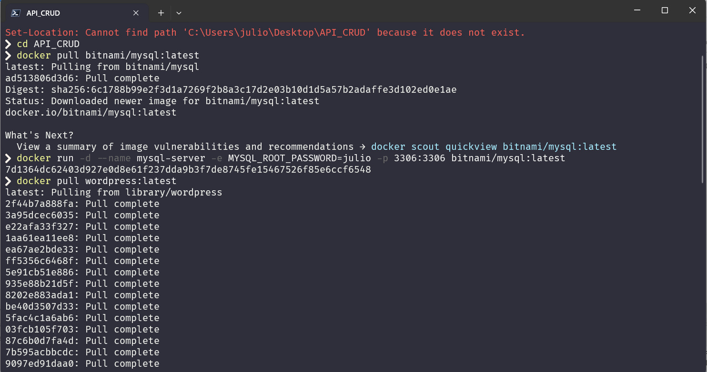
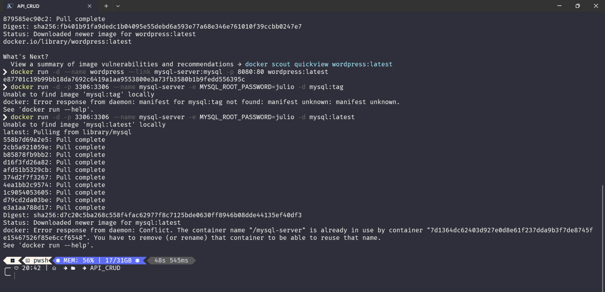
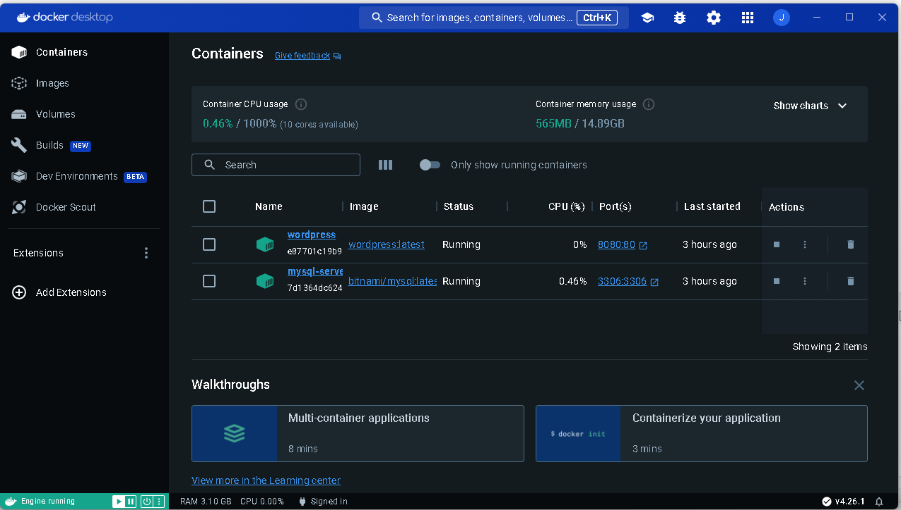
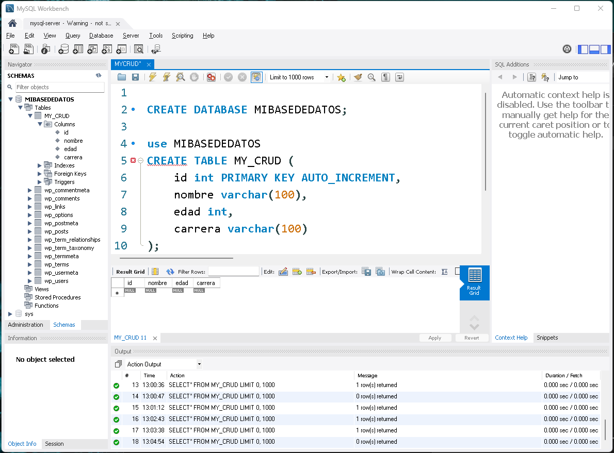
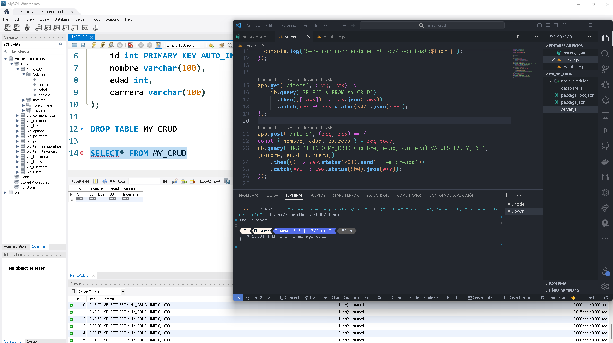
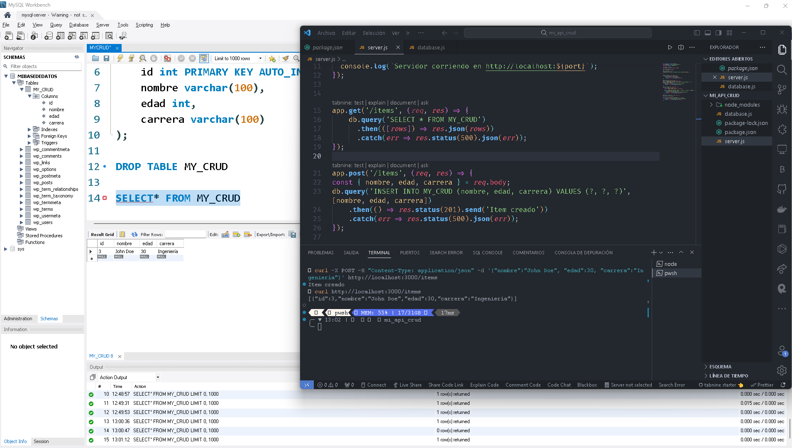
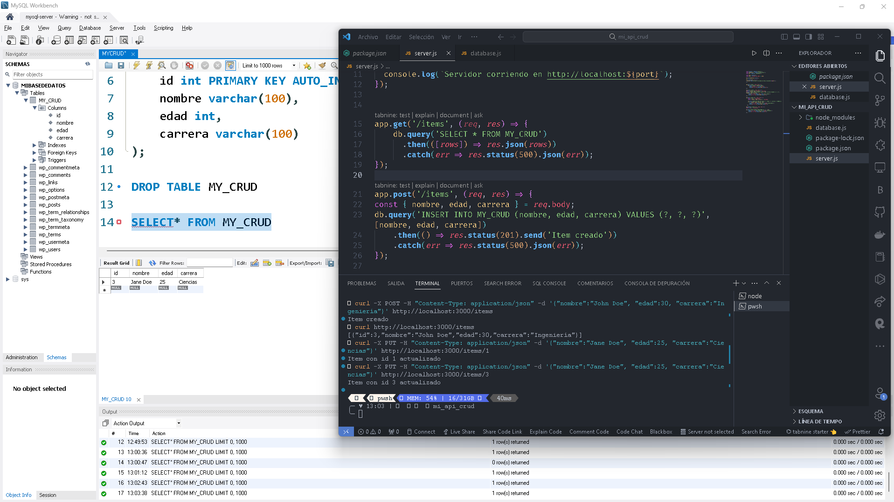
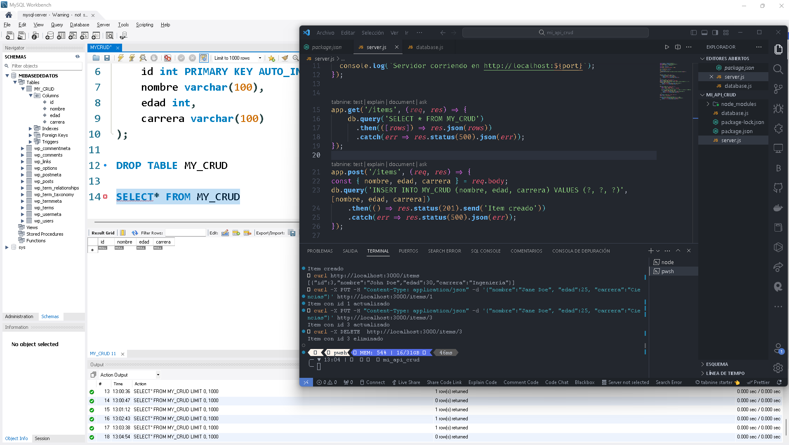

# API_CRUD_MYSQL_NODE.JS

Este proyecto incluye una API en Node.js que realiza operaciones CRUD en una base de datos MySQL. También incluye un entorno Docker con MySQL y WordPress.
Configuración del Entorno con Docker
### Prerrequisitos

    Docker Desktop instalado en máquina.
    Conocimientos básicos de Docker y manejo de contenedores.

## Pasos de Configuración

    MySQL con Docker

    Primero, descarga y ejecuta la imagen de MySQL de Bitnami:

 ```bash

docker pull bitnami/mysql:latest
docker run -d --name mysql-server -e MYSQL_ROOT_PASSWORD=my_password -p 3306:3306 bitnami/mysql:latest
```


Esto iniciará una instancia de MySQL. my_password debe ser reemplazado por contraseña deseada.

WordPress con Docker

A continuación, descarga y ejecuta la imagen de WordPress:

```bash
docker pull wordpress:latest
docker run -d --name wordpress --link mysql-server:mysql -p 8080:80 wordpress:latest
WordPress estará disponible en http://localhost:8080.
```





## Configuración de la API en Node.js
### Prerrequisitos

   Node.js instalado en tu máquina.
   Conocimientos básicos de Node.js y npm.

### Pasos de Configuración

    Clonar el Repositorio

    Instalar Dependencias
```bash

npm install
```
    Configurar Conexión a MySQL

    El archivo database.js tenga las credenciales correctas para conectarse a tu instancia de MySQL.



    Ejecutar la API
```bash

    node server.js

    La API estará disponible en http://localhost:3000.
```

Uso de la API

La API soporta las siguientes operaciones CRUD:

    POST /items: Crea un nuevo item.
   

    GET /items: Obtiene todos los items.
    GET /items/:id: Obtiene un item por su ID.
  

    PUT /items/:id: Actualiza un item por su ID.
  

    DELETE /items/:id: Elimina un item por su ID.
  

La herramienta curl para interactuar con la API.


